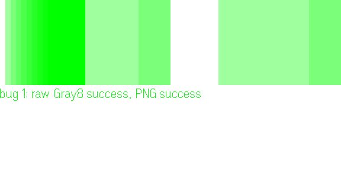

# narrowband

**Probing the image path of Even Realities G2 glasses: what plugin bytes turn into, and what they cost.**

`narrowband` set out to make Even Hub images cheaper to send. On the way it built an automated harness
around the official Even Hub simulator and a pixel-exact model of its image conversion. That harness found
**two bugs in how the simulator handles raw image data**. This README is about those bugs: what they are,
how to reproduce them in one command, and how to work around them. The original encoder project and its
results are under [Background](#background-the-narrowband-project).

| | |
|---|---|
| Affected | `@evenrealities/evenhub-simulator` **0.9.5** (latest as of 2026-10-02), with `@evenrealities/even_hub_sdk` **0.0.16** |
| API | `bridge.updateImageRawData()` with raw bytes (not PNG) |
| Tested on | Windows 11 x64 |
| Real G2 glasses | **Not verified.** No hardware here. See [Help wanted](#help-wanted-real-glasses) |

---

## Bug 1: raw Gray8 values 1–15 are drawn as levels 1–15

**Expected.** A raw Gray8 buffer (one byte per pixel, `width × height` bytes) is converted to the
display's 16 levels like every other 8-bit input: `level = round(v / 17)`. The same pixels sent as an
8-bit PNG are converted exactly this way.

**Actual.** Values **1–15 are taken literally as levels 1–15**. Every other value goes through
`round(v / 17)`. The mapping becomes non-monotonic: **15 renders brighter than 16**.

Measured on a ramp of values 0–31, raw Gray8 vs. the same pixels as PNG (simulator screenshot, read back):

| Value | 0 | 1 | 2 | 3 | 4 | 5 | 6 | 7 | 8 | 9–15 | 16–25 | 26–31 |
|---|---|---|---|---|---|---|---|---|---|---|---|---|
| Raw Gray8 → level | 0 | **1** | **2** | **3** | **4** | **5** | **6** | **7** | **8** | **≥ 9** | 1 | 2 |
| PNG → level (correct) | 0 | 0 | 0 | 0 | 0 | 0 | 0 | 0 | 0 | 1 | 1 | 2 |

(The simulator draws levels 9–15 at the same brightness, so above 8 only "≥ 9" can be observed.)



*Simulator framebuffer from `npm run repro -- 1`. Left: raw Gray8 ramp 0–31, bright through 15 then
dropping back at 16. Right: the same pixels as PNG, correctly dark until 9.*

**Impact.** Near-black pixels light up. A dark (night-like) photo with values 2–26, sent raw, is drawn
brighter than its PNG on **83 % of pixels**, with a mean level of at least 7.0 instead of 0.7. Normally exposed
photos are hit only where they have values 1–15: 0–2.4 % of pixels in our five Kodak test photos.

**Probable cause.** It looks like a per-pixel heuristic meant to accept unpacked 4-bit input (one level
per byte) in the same `width × height` length as Gray8. Applied per pixel, it can't tell a level 8 from
a dark grey of 8. This is a guess; only the behaviour above is measured.

**Workaround.** Never send raw Gray8 values 1–15. Either send levels as `L × 17` (0, 17, 34, … 255, which
land exactly on level L), map 1–15 to 0 (or 17) before sending, or send PNG.

---

## Bug 2: raw buffers that start like an image file are rejected

**Expected.** A raw Gray8 or packed Gray4 buffer of the right length is displayed, whatever its pixel
values.

**Actual.** Before checking the length, the simulator checks whether the first bytes match an image
file's magic number. If they do, it decodes the buffer as that file format, decoding fails, and the call
returns `sendFailed`. **The image is not drawn.** The simulator is built on the Rust `image` crate 0.25.9,
and the behaviour matches that crate's `guess_format` table of 22 magic numbers. We tested five of them
plus controls. Several are only 2–4 bytes, which ordinary pixel data can spell:

| Raw payload starts with | Spells | Result | Control (one value off) |
|---|---|---|---|
| Gray8 pixels **66, 77** | `BM` (BMP) | `sendFailed` | 66, 78 → `success` |
| Gray8 pixels **255, 216, 255** | `FF D8 FF` (JPEG) | `sendFailed` | 255, 216, 254 → `success` |
| Gray8 pixels **80, 53** | `P5` (PNM; `P1`–`P7` are all in the table) | `sendFailed` | 80, 56 → `success` |
| Gray8 pixels **0, 0, 1, 0** | ICO | `sendFailed` | |
| Gray8 pixels **73, 73, 42, 0** | `II*\0` (TIFF) | `sendFailed` | |
| Gray4 bytes `00 00 01 00`: a black row with one level-1 pixel at x = 5 | ICO | `sendFailed` | `00 00 02 00` → `success` |
| Gray4 bytes `50 35`: levels 5, 0, 3, 5 | `P5` (PNM) | `sendFailed` | |
| Gray4 bytes `42 4D`: levels 4, 2, 4, 13 | `BM` (BMP) | `sendFailed` | |

The simulator's own log shows the mechanism:

```
ERROR evenhub_simulator_lib::vm] update_image_raw_data: failed to decode image: Format error decoding Bmp: Bitmap header too small (0 bytes)
ERROR evenhub_simulator_lib::vm] update_image_raw_data: failed to decode image: Format error decoding Pnm: Non-ASCII-digit character when parsing number in number in preamble
ERROR evenhub_simulator_lib::vm] update_image_raw_data: failed to decode image: Format error decoding Ico: ICO directory contains no image
```

**Impact.** Deterministic: a frame whose first pixels match is dropped every time, and the only signal is
a generic `sendFailed`. It is rare in typical content: none of the 6 860 containers in our benchmark
(35 images × 49 encodings × 4 containers) starts with a magic number. But a single dim pixel in the top
row of a black Gray4 frame, or a top-left pixel pair of 66, 77, is enough.

**Workaround.** Before sending raw bytes, check the first bytes against the magic numbers
(`sniffMagic()` in [`sim/host.ts`](sim/host.ts) has the full table) and, on a match, nudge one of the
first pixels by one level. Or send PNG.

---

## How to reproduce

```bash
npm install
npm run repro -- 1     # bug 1
npm run repro -- 2     # bug 2
```

Each command serves a one-file plugin ([`repro/main.ts`](repro/main.ts), public SDK only), opens it in the
official simulator, prints what `updateImageRawData` returned, and saves the glasses framebuffer to
`results/repro/`. Expected output:

```
simulator 0.9.5, SDK 0.0.16
bug 1: raw Gray8 success, PNG success          ← both succeed; compare the two halves of bug1.png
bug 2: first pixels 66,77 → sendFailed; first pixels 66,78 → success
```

To run the page by hand: `npx vite repro`, then `npx evenhub-simulator "http://localhost:5173/?bug=1"`.
The core of each repro:

```ts
//bug 1: ramp 0..31 as raw gray8 (left) and as png (right), should look identical
const ramp = new Uint8Array(288 * 144).map((_, i) => Math.floor((i % 288) / 9))
await bridge.updateImageRawData(new ImageRawDataUpdate({ containerID: 1, containerName: 'left', imageData: ramp }))
await bridge.updateImageRawData(new ImageRawDataUpdate({ containerID: 2, containerName: 'right', imageData: await png(ramp) }))

//bug 2: flat grey but the first two pixels are 66,77 ("BM"), returns sendFailed
const bm = new Uint8Array(288 * 144).fill(128)
bm.set([66, 77])
await bridge.updateImageRawData(new ImageRawDataUpdate({ containerID: 1, containerName: 'left', imageData: bm }))
```

**The full probe** covers every case in the tables above, including the dark photo and all magic numbers:

```bash
npm run probe:run -- bug    # 4 bug cases → results/phase0/screens/bug*.png (opens the simulator)
npm run probe:analyze       # prints the level tables and result codes
npm test                    # replays every probe case through the offline model, pixel for pixel
```

## Other measured behaviour

Not bugs, but undocumented, and worth knowing when sending images
(details in [docs/phase0-pipeline.md](docs/phase0-pipeline.md)):

| Behaviour | Simulator 0.9.5 |
|---|---|
| 8-bit → 4-bit conversion | `round(v / 17)`, **no dithering** (raw or PNG) |
| RGB PNG → grey | BT.601 weights (0.299, 0.587, 0.114) |
| PNG alpha | **Ignored.** A transparent white pixel is drawn white |
| Packed Gray4 nibble order | High nibble = left pixel |
| Packed Gray4, odd widths | Rows padded to whole bytes, `ceil(w / 2) × h` bytes. Unpadded packing → `sendFailed` |
| Wrong raw length | `sendFailed` |
| Display brightness | Levels 9–15 look identical. g2-kit reports the same shape by eye on G2 |

## Help wanted: real glasses

Both bugs are verified in the official simulator only. The Even app on the phone may or may not share the
code. If you have G2 glasses, load `repro/` as you would any plugin under development, open `?bug=1` and
`?bug=2`, and open an issue with what you see. The simulator's README asks for simulator bugs to be
reported in the Even Realities developer Discord.

## Background: the narrowband project

The original goal: get images to the glasses faster by encoding them so they compress better under the
LZ4 compression the host applies since SDK 0.0.12. The plan is in [docs/plan.md](docs/plan.md).

- **Phase 0, the pipeline** ([docs/phase0-pipeline.md](docs/phase0-pipeline.md)). This is where the
  bugs came from. It also produced a transport model. g2-kit timed 16 tile variants on real G2 glasses;
  re-rendering those tiles shows that send time tracks their LZ4 size as packed Gray4 (R² 0.94): about
  177 ms per send + 0.16 ms per byte.
- **Phase 1, the benchmark** ([docs/phase1-benchmark.md](docs/phase1-benchmark.md)). 35 images,
  7 dither methods × 7 level counts. **No-go:** nothing beats the host's own plain quantization by more
  than ~1 % at equal quality. Against Floyd–Steinberg dithering, Bayer 2×2 saves 17–41 % of bytes.

### Running everything

```bash
npm test               # LZ4 vs. liblz4 vectors, Gray4 packing, offline model vs. simulator screenshots
npm run repro -- 1|2   # minimal bug reproductions
npm run probe:run      # Phase 0: all probe cases in the simulator (add a filter, e.g. -- bug)
npm run probe:analyze
npm run calibrate      # transport fit against g2-kit's G2 timings
npm run corpus         # Phase 1 corpus (network for photos/maps; output is committed)
npm run bench && npm run bench:report && npm run figures
```

Node ≥ 24 runs the TypeScript directly; there is no build step.

| Path | What |
|---|---|
| `repro/` | Minimal one-file reproductions of the two bugs |
| `probe/` | Phase 0 probe plugin, simulator driver, screenshot analysis |
| `sim/` | Offline model of the host: format sniffing, conversion, Gray4 packing, LZ4, transport; mock bridge |
| `src/` | LZ4 block codec (bit-exact with liblz4), Gray4 packing, dithers, quality metrics |
| `bench/`, `corpus/` | Phase 1 benchmark and its 35 images |
| `data/g2kit-bench/` | g2-kit's hardware timings and the re-rendered tiles |
| `results/` | Screenshots, analysis and benchmark outputs |

## Prior work

- [Glyph](https://github.com/gabrielevierti/glyph): G2 UI framework that renders a
  full framebuffer and sends only changed tiles.
- [even-img-benchmark](https://github.com/opinsky/even-img-benchmark): benchmark
  harness for the G2 image pipeline.
- [g2-kit](https://github.com/RAZKOM/g2-kit): drawn UI kit for G2 plugins, with the
  on-glasses send timings that the transport model is fitted to.

## References

- [Even Hub FAQ](https://hub.evenrealities.com/docs/reference/faq)
- [Even Hub Display & UI System](https://hub.evenrealities.com/docs/build/display)
- [Even Hub Changelog](https://hub.evenrealities.com/docs/reference/changelog)
- [`@evenrealities/even_hub_sdk` on npm](https://www.npmjs.com/package/@evenrealities/even_hub_sdk)
- [`@evenrealities/evenhub-simulator` on npm](https://www.npmjs.com/package/@evenrealities/evenhub-simulator)
- [`image` crate magic numbers (`guess_format`)](https://github.com/image-rs/image/blob/v0.25.9/src/io/free_functions.rs)

## Author

Ramon Gallinad, Telecommunications Engineering, Universitat Autònoma de Barcelona.

## License

MIT
