# Phase 0: the G2 image pipeline, bytes in → pixels out

**Exit criterion met:** an offline model of the host's image path that reproduces the official simulator
pixel for pixel on every probe case (`test/host-model.test.ts`), plus a transport model calibrated on real
G2 timings.

Probed on **evenhub-simulator 0.9.5** with **@evenrealities/even_hub_sdk 0.0.16**, 2026-10-02, Windows x64.
Re-run with `npm run probe:run && npm run probe:analyze`.

## The model

```
plugin payload ──▶ host (Even app) ─────────────────────────────────────────────▶ BLE ──▶ glasses
                   1. sniff 22 magic numbers (PNG, JPEG, BMP, ICO, PNM, TIFF, …)
                   2. else by length: w·h → raw Gray8, ceil(w/2)·h → packed Gray4, else sendFailed
                   3. to 4-bit levels: PNG  → BT.601 luma, alpha ignored, round(v/17)
                                       Gray8 → round(v/17), but 1–15 taken literally
                                       Gray4 → as is
                   4. pack Gray4 (row-padded, high nibble = left pixel), LZ4 block     ← inferred
```

Steps 1–3 are measured in the simulator. Step 4 cannot be observed there (the simulator does not do LZ4).
It is inferred from the SDK docs and from the timing fit below. The implementation is
[`sim/host.ts`](../sim/host.ts); [`sim/virtual-glasses.ts`](../sim/virtual-glasses.ts) wraps it in a mock
of the bridge's image calls.

## How it was measured

[`probe/`](../probe) is a minimal Even Hub app. [`probe/run.ts`](../probe/run.ts) serves it with Vite,
launches the official simulator with its automation API (`--automation-port`), and steps through the cases
in [`probe/cases.ts`](../probe/cases.ts). For each case it rebuilds the page with up to four image
containers, sends each payload with `updateImageRawData`, records the result code, and saves
`GET /api/screenshot/glasses` to [`results/phase0/screens/`](../results/phase0/screens).
[`probe/analyze.ts`](../probe/analyze.ts) reads the screenshots back. Raw numbers are in
[`results/phase0/analysis.json`](../results/phase0/analysis.json).

| Case | What it sends | What it answers |
|---|---|---|
| `levels-four-ways` | Levels 0–15 as 4-bit PNG, packed Gray4, Gray8 (L×17), 8-bit PNG | Do the encodings agree? Screenshot calibration |
| `gray8-all-values` | All 256 values as raw Gray8 blocks | Raw 8-bit → level mapping |
| `png8-all-values` | Same, as 8-bit grey PNG | Encoded 8-bit → level mapping |
| `gray4-all-bytes` | Every byte value, packed | Nibble order |
| `dither-check` | Ramps and off-level flat fields, Gray8 and PNG | Does the host dither? |
| `png-rgb-channels` | Pure R, G, B ramps | RGB → grey weights |
| `png-rgba-alpha` | Alpha ramps over white, grey, black | Alpha handling |
| `odd-width` | 21×21 containers, two Gray4 packings | Row padding |
| `magic-collision` | Raw buffers that begin with image magic numbers | Format sniffing order |
| `bug1-raw-gray8-low-values` | Ramp 0–31 and a dark photo, raw Gray8 vs. the same pixels as PNG | Bug 1 (README) |
| `bug2-magic-*` | Gray8 and Gray4 buffers starting with BMP, JPEG, PNM, ICO, TIFF magic, each with a one-value-off control | Bug 2 (README) |

### Reading the screenshots

The framebuffer screenshot is RGBA `(0, 255, 0, α)`, where α follows the simulator's display curve:

| Level | 0 | 1 | 2 | 3 | 4 | 5 | 6 | 7 | 8 | 9–15 |
|---|---|---|---|---|---|---|---|---|---|---|
| α | 0 | 96 | 131 | 157 | 179 | 197 | 214 | 230 | 244 | 255 |

**Levels 9–15 are indistinguishable** in the simulator's output, so above level 8 a screenshot only says
"≥ 9". This is the main limit of the method. Everything below that is exact.

## Findings

Two of these are bugs, written up with one-command reproductions in the [README](../README.md#bug-1-raw-gray8-values-115-are-drawn-as-levels-115):
the raw Gray8 1–15 mapping, and magic-number sniffing of raw buffers.

| Question | Answer (simulator 0.9.5) | Evidence |
|---|---|---|
| Encoded 8-bit → level | `round(v / 17)` exactly, every observable value | 0 mismatches over all 256 values (above 144 only "≥ 9" is observable); all blocks uniform |
| Raw Gray8 → level | `round(v / 17)`, **except 1–15, which become levels 1–15** | v = 8 shows as level 8 in raw Gray8 and level 0 in PNG |
| Dithering | **None**, raw or PNG | 0 of 576 ramp columns vary; flat fields uniform |
| Packed Gray4 nibble order | **High nibble = left pixel** | 198 of 198 blocks with unequal nibbles |
| Gray4 row layout | **Each row padded to a whole byte**: `ceil(w/2)·h` bytes | 21×21: 231 B accepted and drawn straight; 221 B (continuous) → `sendFailed` |
| RGB → grey | **BT.601**: 0.299 R + 0.587 G + 0.114 B | Measured intervals R [0.2946, 0.2993), G [0.5850, 0.5885), B [0.1123, 0.1143). BT.709 and the integer 77/150/29 approximation are excluded |
| Alpha | **Ignored**. A fully transparent white pixel shows as white | Alpha ramps over white, grey and black give constant levels |
| Wrong raw length | `sendFailed` | One byte short |
| Format detection order | **Magic numbers first.** A raw buffer starting with any image magic number is decoded as that format and fails → `sendFailed`. Tested: `FF D8 FF`, `BM`, `P5`, `00 00 01 00`, `II*\0`, PNG signature, in Gray8 and Gray4 | `magic-collision`, `bug2-*` |
| Do all four encodings agree? | Yes: 4-bit PNG, Gray4, Gray8 (L×17) and 8-bit PNG draw identical levels | `levels-four-ways` |

### Pitfalls for plugin authors

These follow directly from the table. Each is cheap to avoid once known:

1. **Don't send raw Gray8 with values 1–15** unless you mean levels 1–15. A dark photo's near-black noise
   (v = 1…15) lights up as levels 1–15 instead of 0. Send `L × 17`, or use PNG.
2. **Pad Gray4 rows** for odd widths. Continuous packing is rejected.
3. **Guard raw buffers against magic numbers.** A Gray8 image whose first pixels are 66, 77 (`BM`) or
   255, 216, 255 (`FF D8 FF`), or a black Gray4 frame starting `00 00 01 00`, is taken for an image file
   and rejected. Nudging one pixel by one level avoids it (`sniffMagic()` in `sim/host.ts`).
4. **Flatten alpha yourself.** Transparent pixels show their RGB colour, not the background.
5. **Above level ~9, brighter is not visible** in the simulator, and g2-kit reports the same shape by eye
   on G2. Design with levels 0–9 for distinctions that matter.

## Transport: what a send costs on real glasses

The simulator has no BLE, so timing comes from hardware data someone else measured.
[g2-kit](https://github.com/RAZKOM/g2-kit) timed `updateImageRawData` on G2 glasses + iPhone (30 sends per
case, medians) for 16 tile variants across content, size and surface sweeps. Its benchmark tiles are
deterministic code, so [`data/g2kit-bench/render.ts`](../data/g2kit-bench/render.ts) re-renders exactly
those tiles. Our re-renders reproduce g2-kit's reported SDK byte counts exactly (41 684, 20 876, 20 948,
10 508 and 5 324 B). Each tile is then measured under several candidate "size" definitions, and send time
is regressed on each ([`sim/calibrate.ts`](../sim/calibrate.ts), `npm run calibrate`):

| Size measure | R² | Leave-one-out error |
|---|--:|--:|
| **LZ4 of packed Gray4, `LZ4_compress_default`** | **0.940** | **38 ms** |
| LZ4 of packed Gray4, streaming (u32) table | 0.896 | 52 ms |
| LZ4 of Gray8 | 0.695 | 85 ms |
| Lit (non-zero) pixels | 0.581 | 104 ms |
| Bytes handed to the SDK (PNG) | 0.261 | 131 ms |
| Pixel count | 0.261 | 131 ms |



The LZ4 size of packed Gray4 explains send time far better than any alternative. The default LZ4 table
fits better than the streaming one. This is the strongest available evidence for step 4 of the model, and
for the README's premise that **bytes after LZ4 are what cost time**. The fitted model, used throughout
Phase 1 ([`sim/transport.ts`](../sim/transport.ts)):

> **send time ≈ 177 ms + 0.162 ms per LZ4 byte** (≈ 6.2 KB/s effective)

Two consequences. A full-screen frame (4 sends) pays **~0.7 s in fixed cost** before any pixel data.
The effective rate is well below the FAQ's 10–30 KB/s, because the slope includes everything per send
(bridge, BLE, decode, draw).

**Caveat:** the fit spans 237–2 639 LZ4 bytes per send. Photo and map containers are ~14 KB, so their
time estimates are extrapolations.

## The LZ4 implementation

[`src/lz4.ts`](../src/lz4.ts) is a line-by-line port of `LZ4_compress_default` from liblz4 1.9.x. Its
output is **byte-identical** to liblz4 1.9.4 on 41 single-block reference inputs, and to python-lz4's
streaming path on 102 inputs ([`test/lz4.test.ts`](../test/lz4.test.ts),
[`test/fixtures/lz4-reference.json`](../test/fixtures/lz4-reference.json)). One detail mattered: 64-bit
liblz4 hashes 4 bytes for inputs under 64 KB but 5 bytes in its streaming API. Getting that wrong shifts
sizes by ~1 %.

## Still unknown (needs G2 hardware, Phase 4)

- Levels 9–15: the simulator cannot show them, so `round(v/17)` is assumed there.
- Whether the real host has the raw-Gray8 "1–15 literal" behaviour, or the simulator alone.
- The host's exact LZ4 build. The fit favours `LZ4_compress_default`; Phase 1 checks that rankings don't
  depend on it.
- Send time for payloads above ~2.6 KB, and the panel's true brightness curve.
